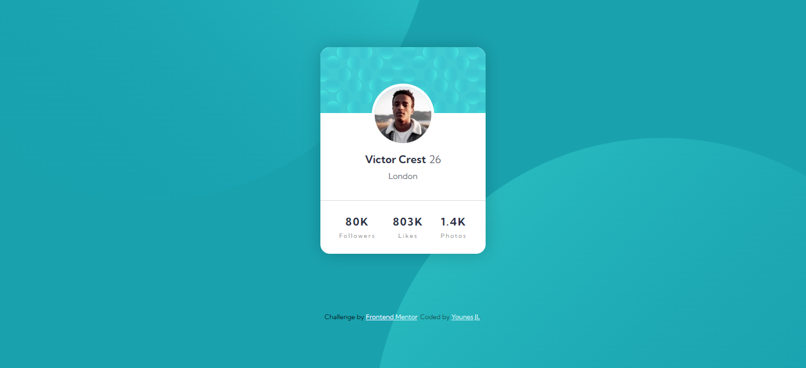

# Frontend Mentor - Profile card component solution

This is a solution to the [Profile card component challenge on Frontend Mentor](https://www.frontendmentor.io/challenges/profile-card-component-cfArpWshJ). Frontend Mentor challenges help you improve your coding skills by building realistic projects.

### Screenshot

### Links
- Live Site URL: (https://younes-dotcom.github.io/Profile-card-component/)

### Built with

- Semantic HTML5 markup
- Flexbox

## Author
- Frontend Mentor - (https://www.frontendmentor.io/profile/Younes-dotcom)https://www.frontendmentor.io/profile/Younes-dotcom)
